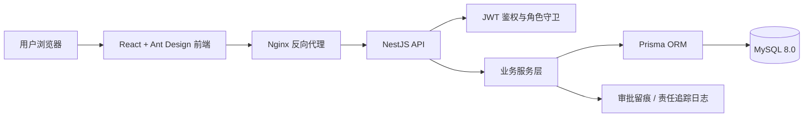
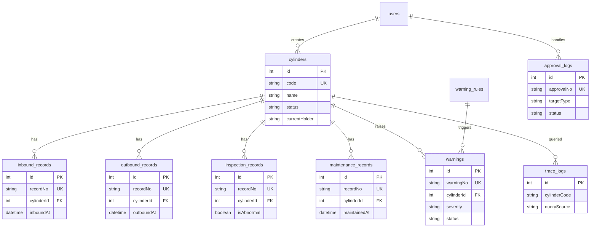

# 工业气瓶流转与安全巡检追踪系统

**让每一只气瓶的入库、流转、巡检、维修和责任闭环都有据可查。**

## 技术栈
- Frontend: React + Vite + Ant Design + Recharts
- Backend: NestJS + Prisma + JWT
- Database: MySQL compatible database through Prisma
- Infra: single Dockerfile delivery with local database, NestJS API and Vite frontend

## 启动指南
交付目录采用 `environment/Dockerfile` 和 `environment/repo/` 结构。进入 `environment` 后构建并启动：

```bash
docker build -t gas-cylinder-flow .
docker run -p 3017:3000 -p 8017:8000 gas-cylinder-flow
```

等待日志出现 Vite ready 和 `后端服务已启动，监听端口 8000` 后，浏览器访问前端地址并使用测试账号登录。

## 服务地址
- Frontend: http://localhost:3017
- Backend Swagger: http://localhost:8017/docs
- Backend Health: http://localhost:8017/api/health

## 测试账号
- Admin: admin / 123456
- Warehouse: warehouse / 123456
- Safety Officer: safety / 123456
- Inspector: inspector / 123456

## 项目摘要
本系统面向工业气瓶、压力容器与特种设备管理场景，解决气瓶台账分散、出入库责任不清、巡检异常缺少闭环、维修记录难追溯等问题。平台以“气瓶档案”为主线，把入库建档、出库流转、巡检记录、维修保养、风险预警和审批留痕串成可查询的生命周期轨迹。

## 系统架构


核心模块职责：
- 气瓶档案管理：维护编码、规格、库位、责任方、巡检与保养周期。
- 出入库流转管理：记录入库、出库过程并同步气瓶状态。
- 安全巡检管理：提交巡检表单，异常巡检自动生成预警。
- 维修保养管理：形成维修台账，并同步维修状态。
- 风险预警管理：维护预警记录和规则，支持安全员处理闭环。
- 责任追踪查询：通过编码或扫码入口查询全生命周期轨迹并记录查询日志。
- 安全看板：汇总在库、预警、巡检完成率、维修中、追踪查询次数。
- 审批留痕：记录关键业务动作的处理意见和时间线。

## 数据设计


数据库配置要点：
- Type: MySQL compatible
- Container host: `127.0.0.1`
- Container port: `3306`
- Database: `gas_cylinder_flow`
- Charset: `utf8mb4`

后端启动时会通过 Prisma 同步表结构，并校验管理员账号和演示数据，确保 `admin / 123456` 首次启动即可登录。

## 接口说明
主要接口均在 Swagger 中可查看：http://localhost:8017/docs

常用接口：
- `POST /api/auth/login` 登录
- `GET /api/auth/me` 获取当前用户
- `GET /api/dashboard/summary` 安全看板指标
- `GET /api/cylinders` 气瓶档案列表
- `POST /api/cylinders` 气瓶编码建档
- `POST /api/records/inbound` 新增入库记录
- `POST /api/records/outbound` 新增出库记录
- `POST /api/records/inspection` 新增巡检记录
- `POST /api/records/maintenance` 新增维修保养记录
- `GET /api/warnings` 风险预警列表
- `PATCH /api/warnings/:id/handle` 处理预警
- `GET /api/trace/search` 责任追踪查询
- `GET /api/approvals` 审批留痕列表

## 功能介绍
1. 气瓶入库 -> 编码建档 -> 出库流转 -> 巡检记录 -> 维修保养 -> 责任追踪。
2. 发现异常 -> 自动生成预警 -> 安全员处理 -> 审批留痕。
3. 多角色工作台：系统管理员、仓库管理员、安全员、巡检员按职责查看不同菜单。
4. 扫码追踪入口：支持扫码枪输入编码，查询后自动写入追踪日志。
5. 安全看板：在库数量、异常预警、巡检完成率、维修中数量、追踪查询次数实时取数。

## 项目结构
```text
Project_Root/
├── README.md                 # 项目交付说明
├── mysql/
│   └── init.sql               # UTF-8 初始化表结构与演示数据
├── backend/
│   ├── prisma/schema.prisma   # Prisma 数据模型
│   └── src/                   # 鉴权、档案、流转、巡检、维修、预警等模块
└── frontend/
    ├── nginx.conf             # 前端静态服务与 API 代理
    └── src/                   # 页面、布局、接口封装、样式
```

## Professional Engineering Practices
| 维度 | 实现情况 |
| --- | --- |
| 日志系统 | NestJS 使用结构化日志输出到 stdout/stderr，支持容器日志排查 |
| 错误处理 | 后端统一 `{code,message,data}` 响应，前端拦截器做单一 Toast 提示与 2 秒去重 |
| 数据校验 | 前端使用 Zod/AntD Rules，后端使用 DTO + class-validator |
| 接口设计 | RESTful API + Swagger 文档 + JWT Bearer 鉴权 |
| 持久化 | 容器内数据库按镜像运行时初始化，适合复现和开发验证 |
| 权限控制 | JWT 守卫 + 角色守卫 + 前端菜单按角色过滤 |
| 中文编码 | MySQL、初始化脚本、接口与页面统一 UTF-8 / utf8mb4 |
| 工程结构 | 前后端分层模块化，容器内完成依赖安装，无需本地 Node 环境 |

## 常见问题
**Q: 端口被占用怎么办？**  
A: 当前前端宿主机端口为 `3017`、后端宿主机端口为 `8017`。可调整 `docker run -p` 左侧宿主机端口，容器内部仍监听前端 `3000` 和后端 `8000`。

**Q: 初始化数据没变化？**  
A: 后端 `BootstrapService` 会在数据库为空时写入演示账号、气瓶档案、巡检、维修、预警和审批留痕数据；已有数据不会重复插入。
